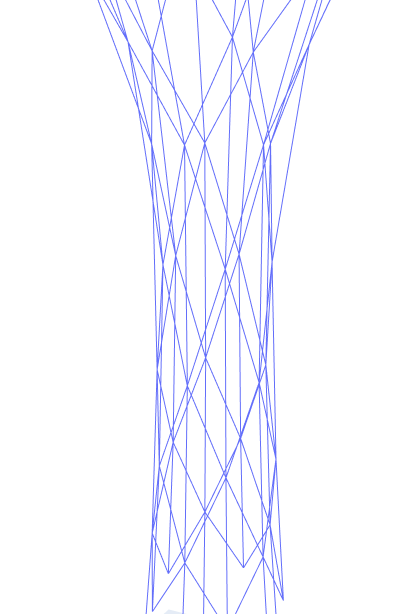

# wickerGen
this tool can be used to generate 3d wicker patterns for building components. At our University, the Karlsruhe Institute of Technology in Germany, we will use this to weave willow branches with a fleet of robots driving on the floor, each holding a branch.

The tool computes the pattern based on knot positions and knot connections which are given as input.

the 2D animation shows how three bundles, consisting of 4, 8, and 4 strands of willow move around each other to form a knot.

This graph is the input to the wickerGen tool.
[]

From this graph the braiding movement of strands in 3d across time is generated.

